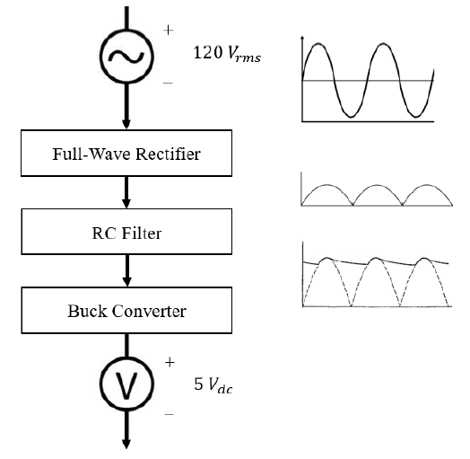
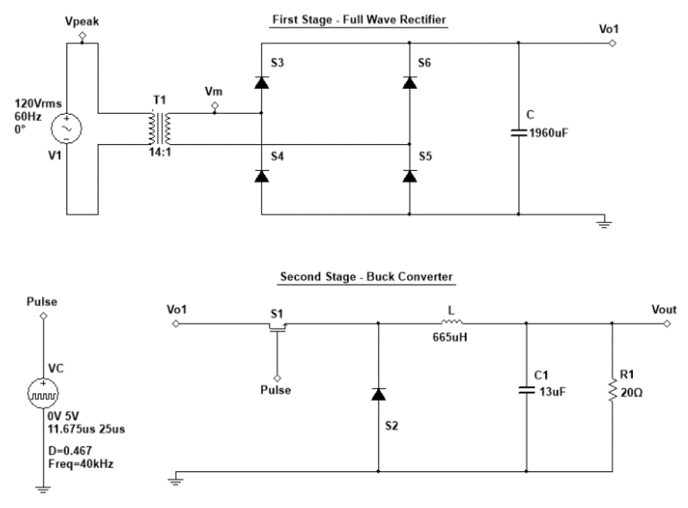
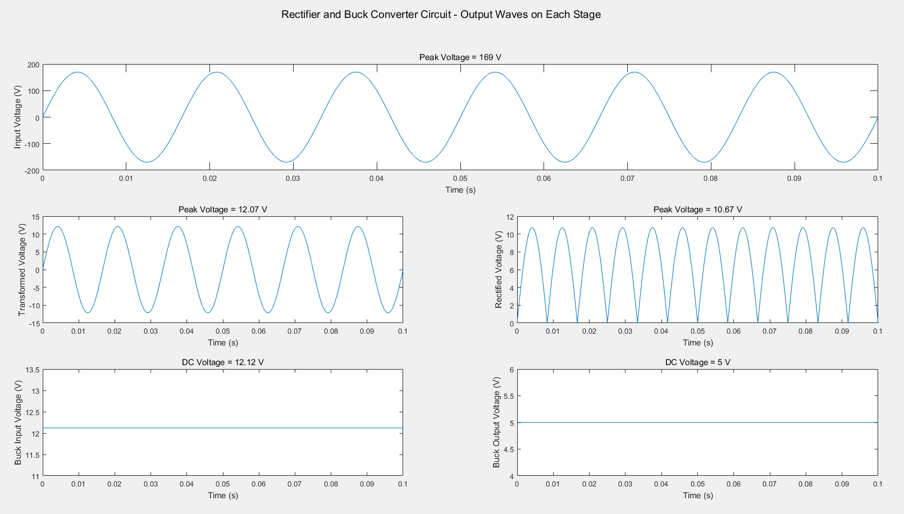

# Power-Converter-Buck
Theoretical design of a 120VAC to 5VDC power converter using a rectifier and buck converter circuit. Analysis of the design done on MATLAB and Multisim. 

## Power Converter - Block Diagram
The figure below shows the theoretical conversions in a power converter circuit:  

## Power Converter Circuit (120VAC - 5VDC)
The following circuit shows the design stages of the converter:  

## Output Voltage Plots
The following figure shows the graphs of the voltage conversions after each stage on the design:  

